# 🦀🔐 smart-locker

A ultra-lightweight CLI tool written in **Rust** to **encrypt, store, and manage sensitive secrets locally** in a secure and durable way.

## 🚀 Purpose

smart-locker solves a real-world problem:

> In a fullstack project with CI/CD pipelines, **tokens, private keys, passphrases, and API keys** become critical.

Storing them in plain text is dangerous. Base64 encoding is not enough. smart-locker offers a reliable, simple, and effective solution.

---

## 🛠️ CLI Architecture

At first start with smart-locker init.

```bash
smart-locker <command> [options]

MAIN COMMANDS:
  encrypt      Encrypt a secret and store it
  decrypt      Decrypt a `.slock` file
  list         List encrypted secrets
  remove       Delete a secret
  init         Generate the master key (locker.key)
  backup-key   Backup the encryption key
  restore-key  Restore the encryption key from a backup
  export       Export secrets to a file in a specified format
  renew        Renew the expiration date of a secret

EXAMPLE:
  smart-locker encrypt -n openai_token -v sk-abc123...
  smart-locker encrypt -n my_secret -v "my value" --tags "tag1,tag2"
  smart-locker decrypt -n openai_token
  smart-locker backup-key
  smart-locker restore-key
  smart-locker export --format env --output .env
  smart-locker renew -n openai_token --days 30
```

ADVANCED:

```bash
OPENAI_API_KEY=$(echo smart-locker decrypt -n openai_token)
```

```bash
echo "This is a test" | smart-locker encrypt -n my_secret
```

```bash
smart-locker decrypt -n my_secret --clipboard
```

```bash
smart-locker export --format env --output .env
```

---

## 🛠️ Installation

smart-locker is available for **Linux** and **Windows**. You can either build it from source (for Rust users), download a ready-to-use binary archive, or install it directly via `cargo`.

---

### ✅ Recommended: Install via Cargo

If you have Rust installed, you can install smart-locker directly from crates.io:

```bash
cargo install smart-locker
```

---

### ✅ Precompiled Binary

#### **Windows (Precompiled Binary)**

1. Download the latest release from the [Releases page](https://github.com/WillIsback/smart-locker/releases).
2. Extract the `smartlocker_windows.zip` archive.
3. (Optional) Add the folder to your `PATH` environment variable for easier use.
4. Run `smart-locker.exe` from any terminal (PowerShell, cmd, or Windows Terminal).

#### **Linux (Build from Source)**

1. Download the latest release from the [Releases page](https://github.com/WillIsback/smart-locker/releases).
2. Extract the `smartlocker_linux.tar.gz` archive:

   ```bash
   tar -xzf smartlocker_linux.tar.gz
   ```

3. Move the binary into your path:

   ```bash
   sudo mv dist/smart-locker /usr/local/bin/
   ```

4. Run:

   ```bash
   smart-locker --version
   ```

---

### ⚙️ Build from Source (For Developers)

#### **Linux**

1. Make sure **Rust** is installed:

   ```bash
   curl --proto '=https' --tlsv1.2 -sSf https://sh.rustup.rs | sh
   ```

2. Clone the repository:

   ```bash
   git clone https://github.com/WillIsback/smart-locker.git
   cd smart-locker
   ```

3. Build the project in release mode:

   ```bash
   cargo build --release
   ```

4. Install the binary:

   ```bash
   sudo cp target/release/smart-locker /usr/local/bin/
   ```

5. Verify:

   ```bash
   smart-locker --version
   ```

#### **Windows**

1. Install **Rust** via [rustup](https://rustup.rs/).

2. Clone the repository:

   ```powershell
   git clone https://github.com/WillIsback/smart-locker.git
   cd smart-locker
   ```

3. Build in release mode:

   ```powershell
   cargo build --release
   ```

4. (Optional) Add to PATH:

   ```powershell
   $Env:Path += ";$PWD\target\release"
   ```

5. Test:

   ```powershell
   .\target\release\smart-locker.exe --version
   ```

---

## 🎯 Key Features

- ✅ Symmetric encryption of secrets (via AES-GCM or similar)
- ✅ Quick decryption using a passphrase or master key
- ✅ Secure folder `~/.locker`
- ✅ Encrypted files with `.slock` or `.aes` extension
- ✅ User-friendly CLI: `smartlocker encrypt`, `decrypt`, `list`, etc.
- ✅ Pipe support (e.g. `cat secret.txt | smartlocker encrypt -n my_secret`)
- ✅ Option: generate key from hashed passphrase (PBKDF2)
- ✅ Option: copy decrypted secret to clipboard
- ✅ Backup and restore encryption keys with `backup-key` and `restore-key`
- ✅ Export secrets to a `.env` file with placeholders for secure decryption
- ✅ Renew expiration dates for secrets with `renew`
- ✅ Automatic expiration management for secrets
- 🔜 Option: Git pre-commit hook to prevent secret leaks

---

## 📦 Tech Stack

- 🦀 **Rust** (>= 1.74)
- 📦 `aes-gcm`, `rand`, `clap`, `serde`, `directories`
- 🔐 Secure encryption based on AES-256 GCM

---

## 🧱 Future Steps

- [ ] Add vault with auto-expiration
- [ ] Git pre-commit plugin to block secrets from being committed

---

## 📈 Why This Project?

Because managing secrets in a fullstack project means:

- Understanding security pitfalls
- Building reliable and portable tools
- Learning how to secure DevOps workflows

---

## 🧠 System Diagram

```mermaid
flowchart TD
    A[smart-locker init] -->|Generates key 🔑| B[~/.locker/locker.key]
    B --> C[smart-locker encrypt]
    B --> D[smart-locker decrypt]
    C -->|CLI input or STDIN| E[.slock encrypted file]
    D -->|Read encrypted file| F[Decrypted secret]
```



---

## 🧱 New Features

### Renew Expiration Dates

- Added the `renew` command to extend the expiration date of a secret.
- Example:

  ```bash
  smart-locker renew -n openai_token --days 30
  ```

- This command updates the expiration metadata for the specified secret, ensuring it remains valid for the specified number of days.

### Improved Expiration Management

- Secrets can now have expiration dates set during encryption.
- Example:

  ```bash
  smart-locker encrypt -n my_secret -v "my value" --tags "tag1,tag2" --days 30
  ```

- If a secret is expired, it will not be accessible until renewed using the `renew` command.

---

## 🗂️ Target Directory Structure

```tree
~/.locker/
├── locker.key         # local symmetric key (or derived from a passphrase)
├── openai_token.slock
├── ssh_key_prod.slock
└── mydb_pass.slock
```

---
---

> 📝 **Note:** If you encounter any issues during installation, please check the [Issues section](https://github.com/WillIsback/smart-locker/issues) or open a new ticket.
> 🦀🔐 *smart-locker* is a personal project to explore Rust deeply while building a useful security tool for everyday DevOps workflows.

## 📝 License

This project is licensed under the MIT License. See the [LICENSE](LICENSE) file for details.

## 🔃 Changelog

See the [CHANGELOG](CHANGELOG.md) for a detailed list of changes and updates.

## 📜 Contributing

Please use the commit message format `feat: <description>` for new features and `fix: <description>` for bug fixes. For more details, see the [Contributing Guide](CONTRIBUTING.md).
